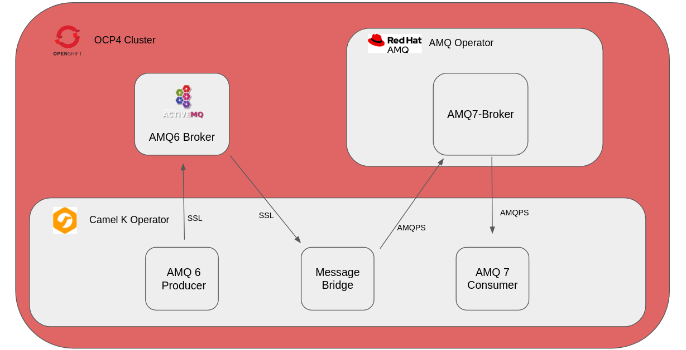

# Connecting AMQ6 with SSL to AMQ7 with CamelK 

For this demo we are using CamelK to produce/consume and bridge messages between AMQ6 and AMQ7.



### Prerequisites:

- Logged on Openshift with oc command
- Cluster admin access on Openshift
- Locally Installed Camel K Client

## Usage:

### Create a Namespace
Create a namespace for the project.

```
oc new-project camelk-ssl
```

### Installing Camel K Operator

As the Cluster admin install the `Red Hat Integration - Camel K` Operator on OCP4 using the Operator Hub. 

### Install AMQ7 broker operator on OCP4

As the Cluster admin install the `Red Hat Intergration - AMQ Broker` on OCP4 using the Operator Hub 

### Create certificates

Create certificates to enable ssl to be secure. You need to use Java8 to ensure compability with AMQ6 and AMQ7. Ensure you change the common name `CN=` on the broker to your server domain name.  
`createcerts.sh` creates the client/broker keystores/truststores. Edit the script to include your common name. 

example:
```
export CLIENT_KEYSTORE_PASSWORD=password
export CLIENT_TRUSTSTORE_PASSWORD=password
export BROKER_KEYSTORE_PASSWORD=password
export BROKER_TRUSTSTORE_PASSWORD=password 

#Client Keystore
keytool -genkey -alias client -keyalg RSA -keystore client.ks -storepass $CLIENT_KEYSTORE_PASSWORD -keypass $CLIENT_KEYSTORE_PASSWORD -dname "CN=camelssl-example, O=RedHat, C=UK"

#Broker Keystore
keytool -genkey -alias broker -keyalg RSA -keystore broker.ks -storepass $BROKER_KEYSTORE_PASSWORD -keypass $BROKER_KEYSTORE_PASSWORD -dname "CN=*.apps.cluster-hhl6r.hhl6r.sandbox55.opentlc.com, O=RedHat, C=UK"

#Export Client PublicKey
keytool -export -alias client -keystore client.ks -storepass $CLIENT_KEYSTORE_PASSWORD -file client.cert

#Export Server PublicKey
keytool -export -alias broker -keystore broker.ks -storepass $BROKER_KEYSTORE_PASSWORD -file broker.cert 

#Import Server PublicKey into Client Truststore
keytool -import -alias broker -keystore client.ts -file broker.cert -storepass $CLIENT_TRUSTSTORE_PASSWORD -trustcacerts -noprompt

#Import Client PublicKey into Server Truststore
keytool -import -alias client -keystore broker.ts -file client.cert -storepass $BROKER_TRUSTSTORE_PASSWORD -trustcacerts -noprompt

#Import Server PublicKey into Server Truststore (i.e.: trusts its self)
keytool -import -alias broker -keystore broker.ts -file broker.cert -storepass $BROKER_TRUSTSTORE_PASSWORD -trustcacerts -noprompt

```

## AMQ7

### Create Secret for broker keystore and truststore for AMQ7

```
oc create secret generic example-amq-secret \
--from-file=broker.ks \
--from-literal=keyStorePassword=password \
--from-file=client.ts=broker.ts \
--from-literal=trustStorePassword=password

```

### Create AMQ7 Broker

Using the AMQ Broker Operator create a new `AMQ Broker`.

```
apiVersion: broker.amq.io/v2alpha4
kind: ActiveMQArtemis
metadata:
  name: example-amq
  application: example-amq
  namespace: camelk-ssl
spec:
  deploymentPlan:
   size: 1
   image: registry.redhat.io/amq7/amq-broker:7.6
   requireLogin: false
  adminUser: admin
  adminPassword: admin
  console:
    expose: true
  acceptors:
  - name: amqp
    protocols: amqp
    port: 5672
    sslEnabled: true
    sslSecret: example-amq-secret
    verifyHost: false
    expose: true
```

### Create AMQ7 Artemis Address 

Using the AMQ Broker Operator create a new `AMQ Broker Address`.

```
apiVersion: broker.amq.io/v2alpha2
kind: ActiveMQArtemisAddress
metadata:
  name: example-testaddress
spec:
  addressName: test
  queueName: test
  routingType: anycast
```

### Testing AMQ7 (optional)

Using Artemis produce messages on your local machine. Ensure you change the URL and Truststore Location.
https://activemq.apache.org/components/artemis/download/

#### Produce Messages
example:
```
./artemis producer --url 'amqps://example-amq7-amqp-0-svc-rte-camelk-ssl.apps.cluster-hhl6r.hhl6r.sandbox55.opentlc.com:443?jms.username=admin&jms.password=admin&transport.trustStoreLocation=/home/marslan/work/camelkssl/client.ts&transport.trustStorePassword=password&transport.verifyHost=false'  --threads 1 --protocol amqp --message-count 10 --destination 'queue://test'
```

#### Consume Messages
example:
```
./artemis consumer --url 'amqps://example-amq7-amqp-0-svc-rte-camelk-ssl.apps.cluster-hhl6r.hhl6r.sandbox55.opentlc.com:443?jms.username=admin&jms.password=admin&transport.trustStoreLocation=/home/marslan/work/camelkssl/client.ts&transport.trustStorePassword=password&transport.verifyHost=false'  --threads 1 --protocol amqp --message-count 10 --destination 'queue://test'
```

## AMQ6

Creating A AMQ6 broker with support for SSL

### Create AMQ6 secrets
```
oc create secret generic example-amq6-secret \
--from-file=broker.ks \
--from-literal=keyStorePassword=password \
--from-file=broker.ts \
--from-literal=trustStorePassword=password
```

### Create AMQ6 Broker
```
oc new-app amq63-ssl -p APPLICATION_NAME=amq6-broker -p MQ_QUEUES=test -p MQ_TOPICS=test -p MQ_USERNAME=admin \
-p MQ_PASSWORD=admin -p AMQ_SECRET=example-amq6-secret -p AMQ_TRUSTSTORE=broker.ts -p AMQ_TRUSTSTORE_PASSWORD=password \
-p AMQ_KEYSTORE=broker.ks -p AMQ_KEYSTORE_PASSWORD=password -n camelk-ssl

```
### Create Route for broker

You need to create a expose a route for AMQ6 using the `amq6-broker-tcp-ssl` service. 
you have to enable TLS Passthrough, this is done by clicking `secure route` and selecting `Passthough` on the `TLS Termination` option. Select `None` for `Insecure Traffic`.


### Testing AMQ6 Broker (optional)
FYI: socket closed warnings after the command is normal
Change Broker URL and Truststore/Keystore Location

https://activemq.apache.org/components/classic/download/

#### Produce Messages
example:
```
./activemq producer \
    -Djavax.net.ssl.trustStore=/home/marslan/work/camelkssl/client.ts \
    -Djavax.net.ssl.trustStorePassword=password \
    -Djavax.net.ssl.keyStore=/home/marslan/work/camelkssl/client.ks \
    -Djavax.net.ssl.keyStorePassword=password \
    --brokerUrl ssl://test-camelk-ssl.apps.cluster-hhl6r.hhl6r.sandbox55.opentlc.com:443 \
    --user admin \
    --password admin \
    --destination queue://test \
    --messageCount 1000 \
    --message HelloWorld
```

#### Consume Messages
example:
```
./activemq consumer \
    -Djavax.net.ssl.trustStore=/home/marslan/work/camelkssl/client.ts \
    -Djavax.net.ssl.trustStorePassword=password \
    -Djavax.net.ssl.keyStore=/home/marslan/work/camelkssl/client.ks \
    -Djavax.net.ssl.keyStorePassword=password \
    -Djavax.net.debug=ssl  \
    --brokerUrl ssl://test-camelk-ssl.apps.cluster-hhl6r.hhl6r.sandbox55.opentlc.com:443 \
    --user admin \
    --password admin \
    --destination queue://test 
```

#### Add to debug
```
-Djavax.net.debug=ssl 
```

## Testing CamelK Integration (optional)

To ensure CamelK is working correctly, you can test it using `HelloCamelK.java`. Feel free to delete the Integration afterwards. 
```
kamel run amq7/HelloCamelK.java
```

## Create the AMQ7 Consumer using CamelK

Create a `amq7` folder to seperate AMQ6 and AMQ7. 

### Create a application properties for the amq7 conusmer 
Create application properties so CamelK and the Integration knows where to look. Specifing URL, username, password, destinationType and destinationName.

Tthe URL requires you to add the keyStoreLocation and trustStoreLocation location within the URL. The keystore and truststore location is where we import the secrets we created earlier. See `Run the Consumer using CamelK` section for explantion.

Create the application.properties in the `amq7/configs/` folder.


example:
```
quarkus.qpid-jms.url=amqps://example-amq7-amqp-0-svc-rte-camelk-ssl.apps.cluster-hhl6r.hhl6r.sandbox55.opentlc.com:443?transport.keyStoreLocation=/etc/ssl/example-amq-secret/broker.ks&transport.keyStorePassword=password&transport.trustStoreLocation=/etc/ssl/example-amq-secret/client.ts&transport.trustStorePassword=password&transport.verifyHost=false
quarkus.qpid-jms.username=admin
quarkus.qpid-jms.password=admin
jms.destinationType=queue
jms.destinationName=test
```
### Create amq7consumer.java

within the `amq7/` folder create `amq7consumer.java`

example: 
```
// camel-k: language=java
// camel-k: dependency=mvn:org.amqphub.quarkus:quarkus-qpid-jms

import org.apache.camel.builder.RouteBuilder;

public class amq7consumer extends RouteBuilder {

  @Override
  public void configure() throws Exception {

    from("jms:{{jms.destinationType}}:{{jms.destinationName}}").to("log:info");
  }
}

```
`camel-k: language=java` and `camel-k: dependency=mvn:org.amqphub.quarkus:quarkus-qpid-jms` provide infomation for camelk to run the java file, it enables camelk to sort out the dependecies.

the file consumes from `jms.url`, `jms.destinationType` and `jms.destinationName` specifed in the `application.properties` and outputs it to the log. 

This is imported when using the `kamel run` command, which is the next step.

### Run the Consumer using CamelK

To run the `amq7consumer.java`

```
kamel run -n camelk-ssl \
--property file:./amq7/configs/application.properties \
--resource secret:example-amq-secret@/etc/ssl/example-amq-secret \
  amq7/amq7consumer.java
```

`--property file:` Allows us to import properties to Camel.

`--resource` allows us to add resources to the Pod, we are adding `example-amq-secret` to the pod and placing it to `/etc/ssl/example-amq-secret` folder within the pod. 

To debug Camek add this to the command:
```
--trait jvm.options=-Djavax.net.debug=all
```

## Create AMQ6 Producer using CamelK

Create a `amq6` folder to seperate AMQ6 and AMQ7. 

### Create application properties for AMQ6

Create application properties so CamelK and the Integration knows where to look. Specifing URL, username, password, destinationType and destinationName.

Tthe URL requires you to add the keyStoreLocation and trustStoreLocation location within the URL. The keystore and truststore location is where we import the secrets we created earlier. See `Run the Producer using CamelK` section for explantion.

Create the application.properties in the `amq6/configs/` folder.

example:
```
activemq.destination.brokerURL=ssl://test-camelk-ssl.apps.cluster-hhl6r.hhl6r.sandbox55.opentlc.com:443
activemq.destination.username=admin
activemq.destination.password=admin
activemq.destination.ssl.keyStorePassword=password
activemq.destination.ssl.keyStoreLocation=/etc/ssl/example-amq6-secret/broker.ks
activemq.destination.ssl.trustStorePassword=password
activemq.destination.ssl.trustStoreLocation=/etc/ssl/example-amq6-secret/broker.ts
activemq.destination.type=queue
activemq.destination.name=test
```

### Create amq6SSLProcducer.java with a customConnectionFactory

within the `amq6/` folder create `amq6SSLProcducer.java`

example: 
```
// camel-k: language=java
// camel-k: dependency=camel:camel-quarkus-activemq
// camel-k: dependency=camel:camel-quarkus-timer
// camel-k: property=period=5000
// camel-k: dependency=mvn:com.github.javafaker:javafaker:1.0.2
// camel-k: dependency=mvn:org.slf4j:slf4j-simple:1.7.32

import org.apache.camel.builder.RouteBuilder;
import com.github.javafaker.Faker;
import org.apache.activemq.ActiveMQSslConnectionFactory;
import org.apache.camel.component.activemq.ActiveMQComponent;
import org.slf4j.Logger;
import org.slf4j.LoggerFactory;
import org.apache.activemq.pool.PooledConnectionFactory;
import javax.enterprise.context.ApplicationScoped;
import javax.inject.Inject;
import org.apache.camel.BindToRegistry;
import org.apache.camel.PropertyInject;

public class amq6SSLProducer extends RouteBuilder {
  @Inject
  PooledConnectionFactory pooledConnectionFactory;

  @PropertyInject("activemq.destination.brokerURL") 
  String destinationBrokerURL;

  @PropertyInject("activemq.destination.username") 
  String destinationUserName;

  @PropertyInject("activemq.destination.password") 
  String destinationPassword;

  @PropertyInject("activemq.destination.ssl.keyStorePassword") 
  String destinationKeystorePassword;

  @PropertyInject("activemq.destination.ssl.trustStorePassword") 
  String destinationTruststorePassword;

  @PropertyInject("activemq.destination.ssl.trustStoreLocation") 
  String destinationTrustStoreLocation;

  @PropertyInject("activemq.destination.ssl.keyStoreLocation") 
  String destinationKeyStoreLocation;

  Logger logger = LoggerFactory.getLogger(amq6SSLProducer.class.getName());
  
  @Override
  public void configure() throws Exception {
    from("timer:foo?fixedRate=true&period={{period}}").bean(this, "generateFakePerson()").to("log:info")
        .to("activemq:{{activemq.destination.type}}:{{activemq.destination.name}}?connectionFactory=#pooledConnectionFactory");
  }

  public String generateFakePerson() {
    Faker faker = new Faker();
    return faker.name().fullName() + " lives on " + faker.address().streetAddress();
  }

  @ApplicationScoped
  public ActiveMQComponent activeMq(PooledConnectionFactory pooledConnectionFactory) {
    ActiveMQComponent activeMqComponent = new ActiveMQComponent();
    activeMqComponent.setConnectionFactory(pooledConnectionFactory);
    activeMqComponent.setCacheLevelName("CACHE_CONSUMER");

    return activeMqComponent;
  }

  @BindToRegistry
  public PooledConnectionFactory pooledConnectionFactory() throws Exception {
    return new PooledConnectionFactory(sslConnectionFactory());
  }

  private ActiveMQSslConnectionFactory sslConnectionFactory() throws Exception {
    ActiveMQSslConnectionFactory connectionFactory = new ActiveMQSslConnectionFactory();
    logger.info("BrokerURL: " + destinationBrokerURL);
    connectionFactory.setBrokerURL(destinationBrokerURL);
    connectionFactory.setUserName(destinationUserName);
    connectionFactory.setPassword(destinationPassword);
    connectionFactory.setTrustStore(destinationTrustStoreLocation);
    connectionFactory.setTrustStorePassword(destinationTruststorePassword);
    connectionFactory.setKeyStore(destinationKeyStoreLocation);
    connectionFactory.setKeyStorePassword(destinationKeystorePassword);

    return connectionFactory;
  }
}

```

`camel-k: ` provide infomation for camelk to run the java file, it also enables camelk to sort out the dependecies.

This File uses a custom connectionFactory to enable the use of SSL to send Produced messages. The messages produced are of a Fake Person using Javafaker. The timer allows a messages to be send every 5000ms.

The `application.properties` are injected to `amq6SSLProducer.java` when we import the property file using the `kamel run` command, which is the next step.

### Run the Producer using CamelK

To run the `amqssl.java`

```
kamel run -n camelk-ssl \
--property file:./amq6/configs/application.properties \
--resource secret:example-amq6-secret@/etc/ssl/example-amq6-secret
  amq6/amqssl.java
```

`--property file:` Allows us to import properties to Camel and to inject properties to the java file.

`--resource` allows us to add resources to the Pod, we are adding `example-amq6-secret` to the pod and placing it to `/etc/ssl/example-amq6-secret` folder within the pod. 

To debug Camek add this to the command:
```
--trait jvm.options=-Djavax.net.debug=all
```

## creating a message bridge between amq6 / amq7 

Create a `message-bridge` folder.

### Create application.properties file.

Create the application.properties in the `message-bridge/configs/` folder.

using `amq6/configs/application.properties` and `amq7/configs/application.properties` to create your message-bridge application.properties. But changing from `destination` to `source`.

Example:
```
#amq6
activemq.source.brokerURL=ssl://test-camelk-ssl.apps.cluster-hhl6r.hhl6r.sandbox55.opentlc.com:443
activemq.source.username=admin
activemq.source.password=admin
activemq.source.ssl.keyStorePassword=password
activemq.source.ssl.keyStoreLocation=/etc/ssl/example-amq6-secret/broker.ks
activemq.source.ssl.trustStorePassword=password
activemq.source.ssl.trustStoreLocation=/etc/ssl/example-amq6-secret/broker.ts
activemq.source.type=queue
activemq.source.name=test

#amq7
quarkus.qpid-jms.url=amqps://example-amq7-amqp-0-svc-rte-camelk-ssl.apps.cluster-hhl6r.hhl6r.sandbox55.opentlc.com:443?transport.keyStoreLocation=/etc/ssl/example-amq-secret/broker.ks&transport.keyStorePassword=password&transport.trustStoreLocation=/etc/ssl/example-amq-secret/client.ts&transport.trustStorePassword=password&transport.verifyHost=false
quarkus.qpid-jms.username=admin
quarkus.qpid-jms.password=admin
jms.destinationType=queue
jms.destinationName=test
```

## create sixToSevenbridge.java

within the `message-bridge/` folder create `sixToSevenBridge.java`

Using a custom SSL connectionFactory to read from the AMQ6 Broker and sending it to our AMQ7 broker. 

Example: 
```
// camel-k: language=java
// camel-k: dependency=camel:camel-quarkus-activemq
// camel-k: dependency=mvn:org.amqphub.quarkus:quarkus-qpid-jms

import org.apache.camel.Processor;
import org.apache.camel.builder.RouteBuilder;
import org.apache.activemq.ActiveMQSslConnectionFactory;
import org.apache.camel.component.activemq.ActiveMQComponent;
import org.apache.activemq.pool.PooledConnectionFactory;
import org.apache.qpid.jms.JmsConnectionFactory;
import javax.enterprise.context.ApplicationScoped;
import javax.inject.Inject;
import org.apache.camel.BeanInject;
import org.apache.camel.BindToRegistry;
import org.eclipse.microprofile.config.inject.ConfigProperty;
import org.apache.camel.PropertyInject;

public class sixToSevenBridge extends RouteBuilder {

  @Inject
  PooledConnectionFactory pooledConnectionFactory;

  @PropertyInject("activemq.source.brokerURL") 
  String sourceBrokerURL;

  @PropertyInject("activemq.source.username") 
  String sourceUserName;

  @PropertyInject("activemq.source.password") 
  String sourcePassword;

  @PropertyInject("activemq.source.ssl.keyStorePassword") 
  String sourceKeystorePassword;

  @PropertyInject("activemq.source.ssl.trustStorePassword") 
  String sourceTruststorePassword;

  @PropertyInject("activemq.source.ssl.trustStoreLocation") 
  String sourceTrustStoreLocation;

  @PropertyInject("activemq.source.ssl.keyStoreLocation") 
  String sourceKeyStoreLocation;

  @PropertyInject("quarkus.qpid-jms.url")
  String destinationBrokerURL;

  @Override
  public void configure() throws Exception {
    from("activeMQSource:{{activemq.source.type}}:{{activemq.source.name}}").to("log:info")
    .to("jms:{{jms.destinationType}}:{{jms.destinationName}}?connectionFactory=artemisConnectionFactory");
  }

  @BindToRegistry("artemisConnectionFactory")
  public JmsConnectionFactory connectionFactory() throws Exception {
    return new JmsConnectionFactory(destinationBrokerURL);
  }

  @BindToRegistry("activeMQSource")
  public ActiveMQComponent activeMQSource() throws Exception{
    ActiveMQComponent activeMqComponent = new ActiveMQComponent();
    activeMqComponent.setConnectionFactory(pooledConnectionFactorySource());
    activeMqComponent.setCacheLevelName("CACHE_CONSUMER");
    return activeMqComponent;
  }

  @BindToRegistry("pooledConnectionFactorySource")
  public PooledConnectionFactory pooledConnectionFactorySource() throws Exception {
    return new PooledConnectionFactory(sslConnectionFactorySource());
  }

  private ActiveMQSslConnectionFactory sslConnectionFactorySource() throws Exception {
    ActiveMQSslConnectionFactory connectionFactory = new ActiveMQSslConnectionFactory();
    System.out.println("BrokerURL: " + sourceBrokerURL);
    connectionFactory.setBrokerURL(sourceBrokerURL);
    connectionFactory.setUserName(sourceUserName);
    connectionFactory.setPassword(sourcePassword);
    connectionFactory.setTrustStore(sourceTrustStoreLocation);
    connectionFactory.setTrustStorePassword(sourceTruststorePassword);
    connectionFactory.setKeyStore(sourceKeyStoreLocation);
    connectionFactory.setKeyStorePassword(sourceKeystorePassword);

    return connectionFactory;
  }
}
```

## Run sixToSevenBridge using Camel K

```
kamel run -n camelk-ssl \
--property file:./message-bridge/configs/application.properties message-bridge/sixToSevenBridge.java \
--resource secret:example-amq6-secret@/etc/ssl/example-amq6-secret \
--resource secret:example-amq-secret@/etc/ssl/example-amq-secret
```
`--property file:` Allows us to import properties to Camel and to inject properties to the java file.

`--resource` allows us to add resources to the Pod, we are adding both `example-amq6-secret` and `example-amq-secret` to the pod and placing it to `/etc/ssl/` folder within the pod. 


## References:

https://gist.github.com/welshstew/45366bbd230c24e3c289038c9eb2665d

https://developers.redhat.com/blog/2020/08/26/connecting-external-clients-to-red-hat-amq-broker-on-red-hat-openshift#summary


## Special thanks to Joao Tavares and Anton Giertli.